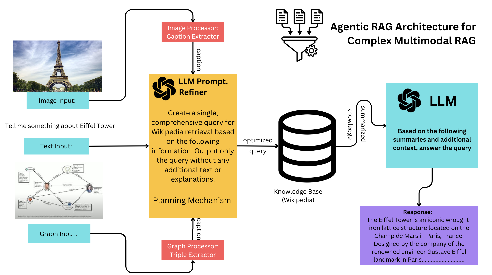

# Multimodal RAG Agent



This project implements a **Retrieval-Augmented Generation (RAG) Agent** designed to process multimodal queries—text, images, and graphs—and retrieve relevant information from Wikipedia. The agent refines queries, fetches documents, and generates responses using a combination of LangChain’s `WikipediaRetriever` and OpenAI’s GPT-4 model.

## Overview

The RAG Agent takes inputs from multiple modalities:
- **Text Query**: A user-provided question or statement (e.g., "Tell me about the Eiffel Tower").
- **Image Description**: A textual description of an image (e.g., "A tall iron tower in Paris").
- **Graph Description**: Structured data in text form (e.g., "Eiffel Tower - located in - Paris; Eiffel Tower - built in - 1889").

It refines these inputs into optimized queries, retrieves relevant Wikipedia documents, and generates a cohesive response by summarizing the retrieved content with additional context.

## Features

- **Query Refinement**: Uses GPT-4 to optimize queries for better Wikipedia retrieval.
- **Multimodal Retrieval**: Combines text, image, and graph inputs into unified and modality-specific queries.
- **Duplicate Removal**: Ensures unique Wikipedia documents are retrieved.
- **Response Generation**: Summarizes documents and integrates additional context for a natural-language answer.
- **Error Handling**: Gracefully handles cases where no documents are retrieved.

## Requirements

- Python 3.8+
- Dependencies:
  - `langchain` (for `WikipediaRetriever` and LLM integration)
  - `openai` (for GPT-4 API access)
- An OpenAI API key (set as an environment variable)

## Installation

1. **Clone the Repository**:
   ```bash
   git clone https://github.com/trilokpadhi/agentic-rag.git
   cd agentic-rag
   ```
2. **Install Dependencies**:
    ```bash
    pip install langchain openai
    ```
3.  **Set Up Environment Variables - Export your OpenAI API key**:
    ```bash
    export OPENAI_API_KEY_TP="your-openai-api-key"
    ```
## Usage

### Run the Script

The script includes a sample query in the `if __name__ == '__main__':` block:
```python
text_query = "Tell me about the Eiffel Tower."
image_description = "A tall iron tower in Paris."
graph_description = "Eiffel Tower - located in - Paris; Eiffel Tower - built in - 1889."
```

Execute it:
```bash
python rag_agent.py
```

### Output

The agent will:
- Refine each modality’s query.
- Retrieve Wikipedia documents.
- Generate and print a response (e.g., details about the Eiffel Tower’s history and significance).

### Customize

Modify the `text_query`, `image_description`, or `graph_description` variables to test different inputs.

### Code Structure

- `__init__`: Initializes the agent with a WikipediaRetriever and GPT-4 model.
- `refine_query`: Optimizes a query using GPT-4, incorporating additional context.
- `create_unified_query`: Combines all modalities into a single query.
- `retrieve_documents`: Fetches Wikipedia documents for each modality and a unified query, removing duplicates.
- `generate_response`: Summarizes retrieved documents and generates a response.
- `process_query`: Orchestrates the full pipeline from query to response.

### Example

**Input**
```python
text_query = "Tell me about the Eiffel Tower."
image_description = "A tall iron tower in Paris."
graph_description = "Eiffel Tower - located in - Paris; Eiffel Tower - built in - 1889."
```

**Output**
```bash
Refined text query: Eiffel Tower history construction significance Paris 1889
Refined image query: Eiffel Tower Paris iron tower 1889
Refined graph query: Eiffel Tower Paris location construction 1889
Response: The Eiffel Tower is a historic iron structure in Paris, completed in 1889 as the entrance arch for the World’s Fair...
```
